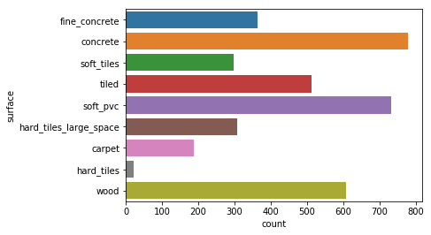
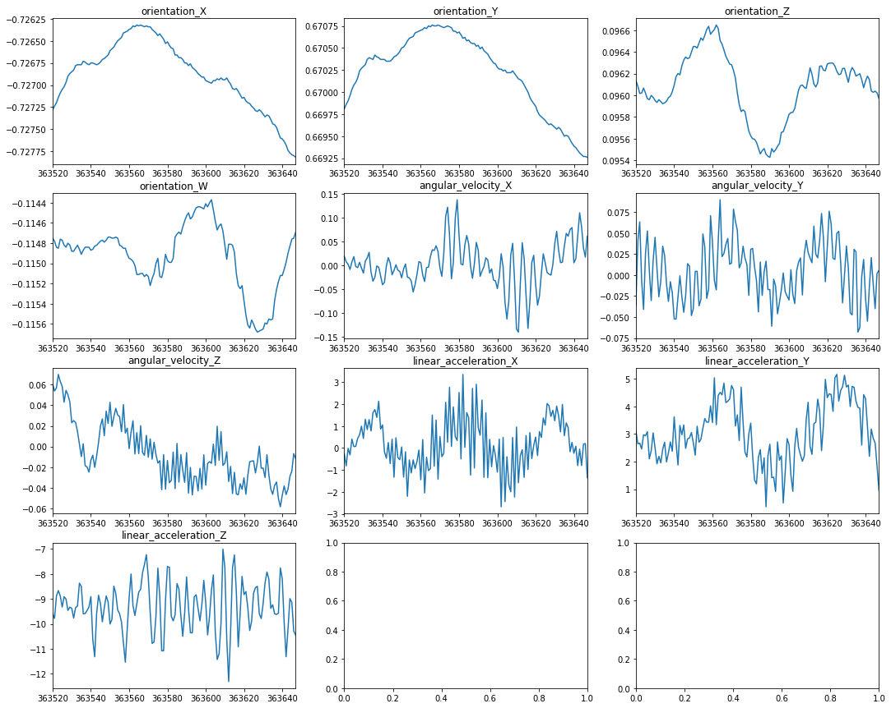
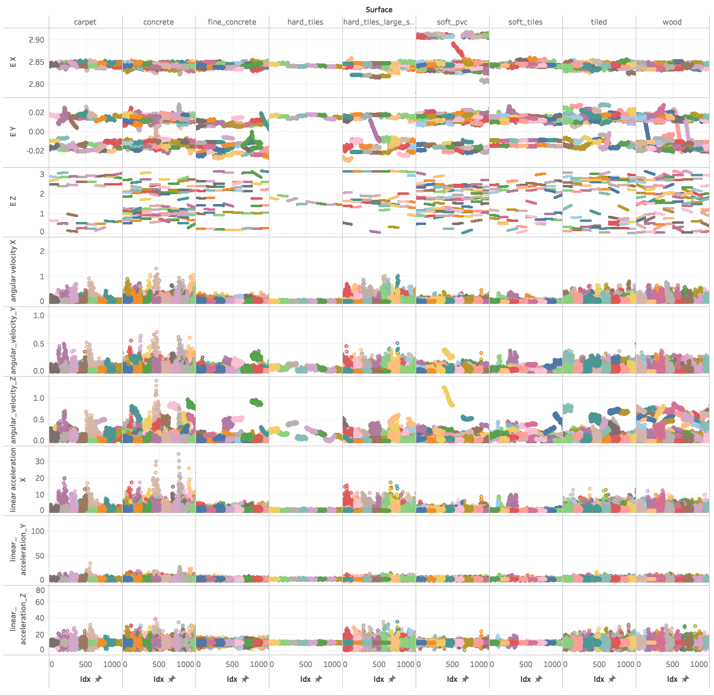
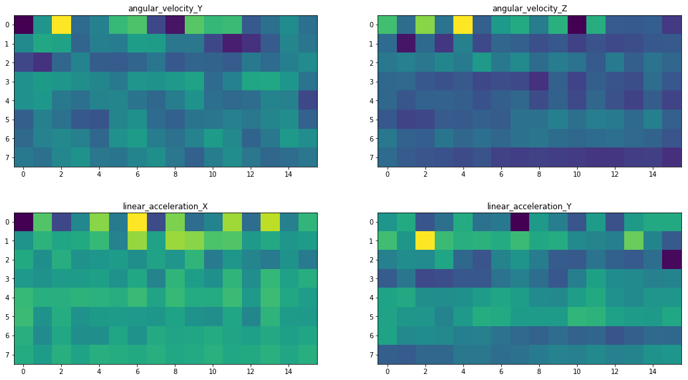
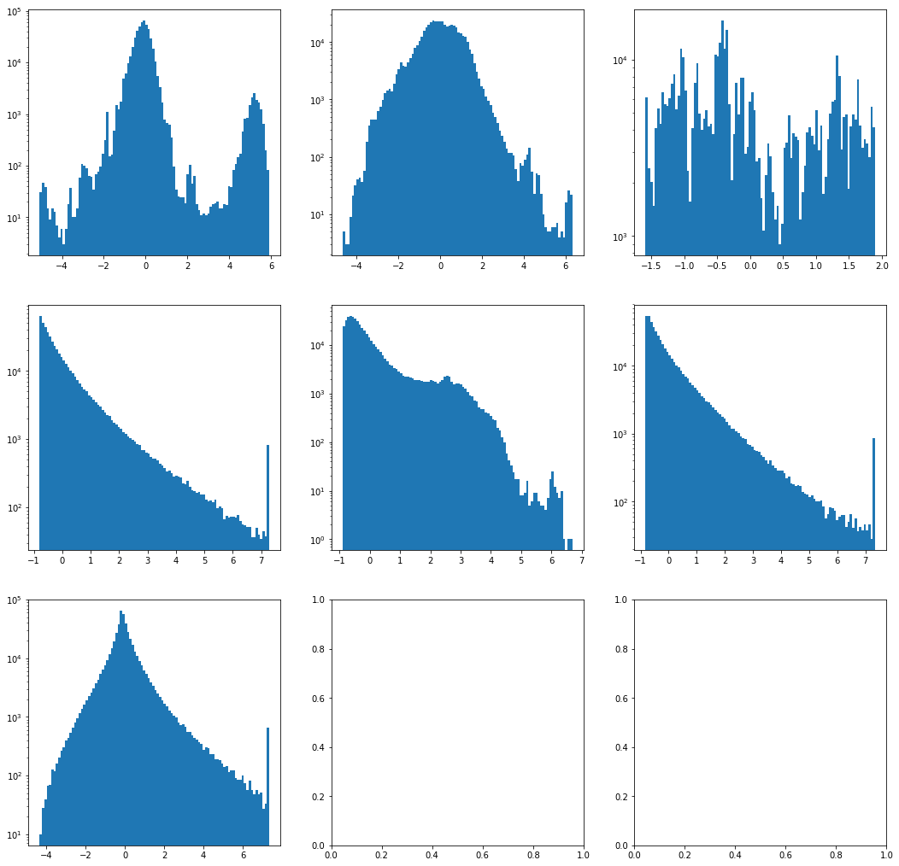
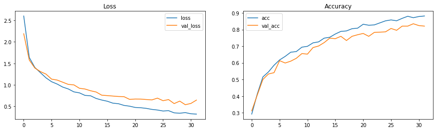
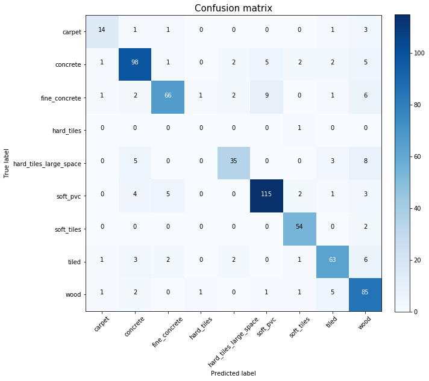
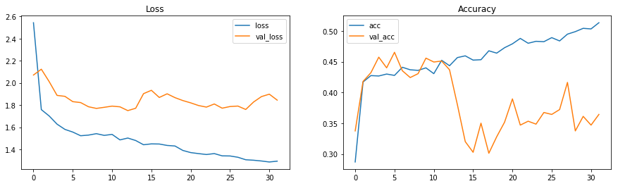
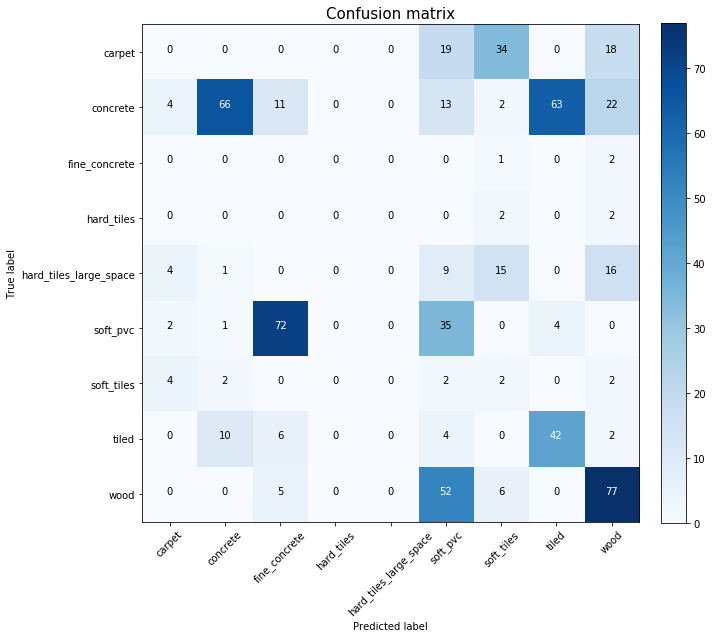
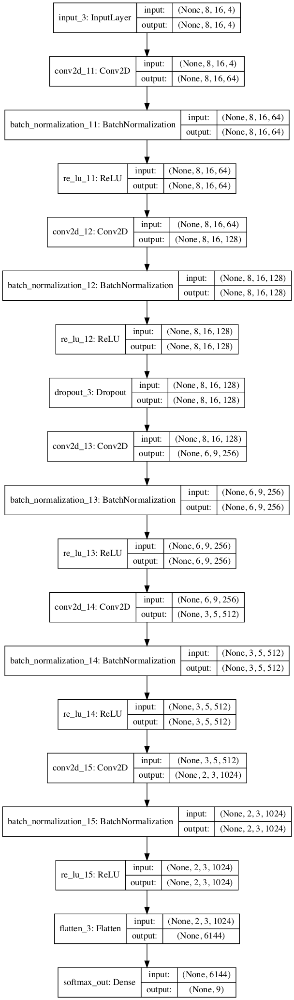

# HelpNavigateRobots Using Convolutional Neural Networks
Detect the surfaces that robots are riding on using machine learning.


# Let's detect some surfaces!

In this project our task is to detect the floor surface the robots are moving on. Data is collected from Inertial Measurement Units (IMU). 
This is from the Kaggle competition at https://www.kaggle.com/c/career-con-2019
The objective is to help robots navigate by detecting the surface they are moving on. We have access to orientation, angular velocity and linear acceleration.

# What's new here
    - I use CNN as the classifier.
    - Since the number of channels is ~7 to 9, it was not possible to use pre-trained models. I tried a couple but they all had hard requirement of 3-4 channels.
    - I implement an image generator which rotates the data in time. It should not matter where our measurement started.
    - I use normalization to scale data.
    
# Results
    - With about 30 epochs we get accuracy close to 90% for validation and around 60-70% for test data.
    - This is a fairly good result so far. We can make the model more complicated by bringing in the frequncy analysis, but that's for another work.  
    - It is well established in my other notebook (based on random forest) and from other people's kernels that this data is leaky. Basically, orientation plays an important role in improving accuracy. This is weird because on any surface we should be able to go in many directions. 
    - Given the leaky nature of this data, I take this as an exercise for learning more rather than a task to get the highest accuracy. 
    
# What I learned
    - Detecting leaky data
    - How to implement my own image generator
    - How to implement call backs on Keras for both model.fit and model.fit_generator
    - Angular velocity and linear acceleration signal, vibration frequencies, fourier transform of these, etc.
    - Running CNN on this data does not seem to be ideal due to the long time needed for training which makes cross-validation difficult. 


```python
# i think we should implement CV on surface and group_id.
import os
import time
import numpy as np
import pandas as pd
from seaborn import countplot,lineplot, barplot
import matplotlib.pyplot as plt

from sklearn.preprocessing import LabelEncoder
from sklearn.model_selection import KFold
from sklearn.metrics import accuracy_score, confusion_matrix

from sklearn.utils import shuffle as sk_shuffle

from sklearn.ensemble import RandomForestClassifier
from sklearn.metrics import precision_recall_fscore_support

from sklearn.metrics import precision_score, recall_score, f1_score
import keras as keras
from keras.models import load_model

%matplotlib inline
```

    Using TensorFlow backend.


## Data Exploration


```python
# Input parameters
r_image_height = 8
r_image_width  = 16
col_keywords = ['e_', 'angular', 'linear']    # columns starting with these keywords are included in model. 

shuffle_train = True
HPF_enabled = False

# Ignore UndefinedMetricWarning for Precision/Recall
import warnings
from sklearn.exceptions import UndefinedMetricWarning
warnings.filterwarnings(action='ignore', category=UndefinedMetricWarning)
```


```python
train = pd.read_csv('../input/X_train.csv')
test = pd.read_csv('../input/X_test.csv')
target = pd.read_csv('../input/y_train.csv')
submission = pd.read_csv('../input/sample_submission.csv')
```


```python
train.head()
```


<div>
<style scoped>
    .dataframe tbody tr th:only-of-type {
        vertical-align: middle;
    }

    .dataframe tbody tr th {
        vertical-align: top;
    }

    .dataframe thead th {
        text-align: right;
    }
</style>
<table border="1" class="dataframe">
  <thead>
    <tr style="text-align: right;">
      <th></th>
      <th>row_id</th>
      <th>series_id</th>
      <th>measurement_number</th>
      <th>orientation_X</th>
      <th>orientation_Y</th>
      <th>orientation_Z</th>
      <th>orientation_W</th>
      <th>angular_velocity_X</th>
      <th>angular_velocity_Y</th>
      <th>angular_velocity_Z</th>
      <th>linear_acceleration_X</th>
      <th>linear_acceleration_Y</th>
      <th>linear_acceleration_Z</th>
    </tr>
  </thead>
  <tbody>
    <tr>
      <th>0</th>
      <td>0_0</td>
      <td>0</td>
      <td>0</td>
      <td>-0.75853</td>
      <td>-0.63435</td>
      <td>-0.10488</td>
      <td>-0.10597</td>
      <td>0.107650</td>
      <td>0.017561</td>
      <td>0.000767</td>
      <td>-0.74857</td>
      <td>2.1030</td>
      <td>-9.7532</td>
    </tr>
    <tr>
      <th>1</th>
      <td>0_1</td>
      <td>0</td>
      <td>1</td>
      <td>-0.75853</td>
      <td>-0.63434</td>
      <td>-0.10490</td>
      <td>-0.10600</td>
      <td>0.067851</td>
      <td>0.029939</td>
      <td>0.003385</td>
      <td>0.33995</td>
      <td>1.5064</td>
      <td>-9.4128</td>
    </tr>
    <tr>
      <th>2</th>
      <td>0_2</td>
      <td>0</td>
      <td>2</td>
      <td>-0.75853</td>
      <td>-0.63435</td>
      <td>-0.10492</td>
      <td>-0.10597</td>
      <td>0.007275</td>
      <td>0.028934</td>
      <td>-0.005978</td>
      <td>-0.26429</td>
      <td>1.5922</td>
      <td>-8.7267</td>
    </tr>
    <tr>
      <th>3</th>
      <td>0_3</td>
      <td>0</td>
      <td>3</td>
      <td>-0.75852</td>
      <td>-0.63436</td>
      <td>-0.10495</td>
      <td>-0.10597</td>
      <td>-0.013053</td>
      <td>0.019448</td>
      <td>-0.008974</td>
      <td>0.42684</td>
      <td>1.0993</td>
      <td>-10.0960</td>
    </tr>
    <tr>
      <th>4</th>
      <td>0_4</td>
      <td>0</td>
      <td>4</td>
      <td>-0.75852</td>
      <td>-0.63435</td>
      <td>-0.10495</td>
      <td>-0.10596</td>
      <td>0.005135</td>
      <td>0.007652</td>
      <td>0.005245</td>
      <td>-0.50969</td>
      <td>1.4689</td>
      <td>-10.4410</td>
    </tr>
  </tbody>
</table>
</div>


```python
train.shape, test.shape
```


    ((487680, 13), (488448, 13))


```python
countplot(y='surface', data=target)
plt.show()
```





This is a multi-class classification problem. It's supervised and has imbalanced classes.
Each measurement has 128 data points taken over time for each sensor. The identifier for each measurement is series_id. Then each measurement is repeated on the same surface multiple times which is identified by group_id.

The chart below shows the number of group_id values for each surface in training data. 


```python
target.groupby('surface')['group_id'].nunique()
```


    surface
    carpet                     4
    concrete                  15
    fine_concrete              7
    hard_tiles                 1
    hard_tiles_large_space     5
    soft_pvc                  14
    soft_tiles                 6
    tiled                      9
    wood                      12
    Name: group_id, dtype: int64


Let's check out the features for a specific series_id.
So we plot each feature vs index. Each graph has 128 points which is the number of points per each series_id. This is one recording session.


```python
temp_sid = train.series_id.sample(1)
df = train[train.series_id.isin(temp_sid)]

fig, ax =plt.subplots(4,3, figsize=(18,15))
cols = df.columns[3:]
for i, col in enumerate(cols):
    plt.subplot(4,3, i+1)
    df[col].plot()
    plt.title(col)
```





Here's all the data plotted together. 
    - Each row is for 1 feature. 
    - Each column is for 1 surface. 
    - X-axis is just sample number. 
    - Y-axis is the feature values. 
    - Colors represent different series_id.
    - E_X, E_Y, E_Z are euler transformations of orientation data. See Feature Engineering for code.


```python
from IPython.display import Image
Image("../input/plain-data/Plain_Data.png")
```





#### What do we learn from above?

    E_X is pretty much constant. 
    E_Y takes values between -0.02 and +0.02 with most data aggregated in certain locations.
    E_Z seems to be the main direction in which the robot drove.

    Between the velocity and acceleration features, there seems to be distinct difference between the magnitude among different surfaces. So this might be useful. 
    We cannot see differences in vibration frequencies from here but we are hoping that CNNs can detect this.
    There are differences in magnitude of velocity and acceleration in different directions. I'll skip detailed explanation but I have looked at these differences.


## Why CNN?

In determining the surface, we probably need to look at the patterns in sensor data. For example specific range of frequencies or amplitudes which can distinguish between surfaces. One way would be to check the fourier transform. Another way would be to let a convolutional network learn the patterns and come up with a good classifier. 


## Data manipulation

In this regard, I treat the input data as images each with 128 pixels (or data points). We can reshape the 128 points to 8x16 or 128x1 image. I use 16x8 which produced good results. Then each of the features (orientation, angular velocity and linear acceleration) would be 1 channel. 

I prefer not to use orientation since the surface should not depend on that. But it is well established in my other notebook (Random Forest) that the data is most likely leaky and orientation plays an important role in determining the surface. So in real world, I would talk to the data collectors to understand what happened and try to collect better data. We don't have that luxary here, so I'm going to treat this as is and play with it.

So I will be using 3x euler features, 2x angular velocity and 2x linear acceleration features totaling 7 features. The input image will have 7 channels and be of size 8x16. 

Here's a sample data of input image.


```python
# Let's plot 4 of the features which will form an image with 4 channels. Each image below is for 1 channel.
fig, ax =plt.subplots(2,2, figsize=(18,10))
i = 1

temp_sid = train.series_id.sample(1)
df = train[train.series_id.isin(temp_sid)]

cols = ['angular_velocity_Y', 'angular_velocity_Z', 'linear_acceleration_X', 'linear_acceleration_Y']

for i, col in enumerate(cols):
    plt.subplot(2,2, i+1)
    plt.imshow(df[col].ravel().reshape(-1,r_image_width));
    plt.title(col)
    
```





For us humans, there's not much to deduce from images above. However, as we will see, the machine can train and extract meaningful information from this.

## Feature Engineering

Let's convert angular velocity and linear acceleration to all positive numbers.
I also found out that combining velocity and acceleration in Y and Z directions help. This makes sense because from the data, it seems like the robot is moving in the Y-Z plane. I argue that the direction in the Y-Z plane does not determine the vibration frequencies. So We should combine the velocity and acceleration on this plane.


```python
# convert to abs all cols
train[train.columns[7:]] = train[train.columns[7:]].abs()
test[test.columns[7:]]   = test[test.columns[7:]].abs()
```


```python
# Tranform orientation to Euler xyz
from scipy.spatial.transform import Rotation as R
def quat_to_euler(df):
    r = R.from_quat(df[['orientation_X', 'orientation_Y', 'orientation_Z', 'orientation_W']])
    r = r.as_euler('xyz')
    df['e_x'] = r[:, 0]
    df['e_y'] = r[:, 1]
    df['e_z'] = r[:, 2]
    return df

train = quat_to_euler(train)
test  = quat_to_euler(test)
```


```python
# Sum up angular velocity on Y & Z and drop original
train['angular_velocity_YZ'] = (train['angular_velocity_Y'].pow(2) + train['angular_velocity_Z'].pow(2)).pow(0.5)
train.drop(columns=['angular_velocity_Y', 'angular_velocity_Z'], inplace=True)
test['angular_velocity_YZ'] = (test['angular_velocity_Y'].pow(2) + test['angular_velocity_Z'].pow(2)).pow(0.5)
test.drop(columns=['angular_velocity_Y', 'angular_velocity_Z'], inplace=True)
```


```python
# Sum up linear acceleration on Y & Z and drop original
train['linear_acceleration_YZ'] = (train['linear_acceleration_Y'].pow(2) + train['linear_acceleration_Z'].pow(2)).pow(0.5)
train.drop(columns=['linear_acceleration_Y', 'linear_acceleration_Z'], inplace=True)
test['linear_acceleration_YZ'] = (test['linear_acceleration_Y'].pow(2) + test['linear_acceleration_Z'].pow(2)).pow(0.5)
test.drop(columns=['linear_acceleration_Y', 'linear_acceleration_Z'], inplace=True)
```


```python
train.head()
```


<div>
<style scoped>
    .dataframe tbody tr th:only-of-type {
        vertical-align: middle;
    }

    .dataframe tbody tr th {
        vertical-align: top;
    }

    .dataframe thead th {
        text-align: right;
    }
</style>
<table border="1" class="dataframe">
  <thead>
    <tr style="text-align: right;">
      <th></th>
      <th>row_id</th>
      <th>series_id</th>
      <th>measurement_number</th>
      <th>orientation_X</th>
      <th>orientation_Y</th>
      <th>orientation_Z</th>
      <th>orientation_W</th>
      <th>angular_velocity_X</th>
      <th>linear_acceleration_X</th>
      <th>e_x</th>
      <th>e_y</th>
      <th>e_z</th>
      <th>angular_velocity_YZ</th>
      <th>linear_acceleration_YZ</th>
    </tr>
  </thead>
  <tbody>
    <tr>
      <th>0</th>
      <td>0_0</td>
      <td>0</td>
      <td>0</td>
      <td>-0.75853</td>
      <td>-0.63435</td>
      <td>-0.10488</td>
      <td>-0.10597</td>
      <td>0.107650</td>
      <td>0.74857</td>
      <td>2.843273</td>
      <td>-0.024668</td>
      <td>1.396667</td>
      <td>0.017578</td>
      <td>9.977350</td>
    </tr>
    <tr>
      <th>1</th>
      <td>0_1</td>
      <td>0</td>
      <td>1</td>
      <td>-0.75853</td>
      <td>-0.63434</td>
      <td>-0.10490</td>
      <td>-0.10600</td>
      <td>0.067851</td>
      <td>0.33995</td>
      <td>2.843201</td>
      <td>-0.024662</td>
      <td>1.396651</td>
      <td>0.030130</td>
      <td>9.532578</td>
    </tr>
    <tr>
      <th>2</th>
      <td>0_2</td>
      <td>0</td>
      <td>2</td>
      <td>-0.75853</td>
      <td>-0.63435</td>
      <td>-0.10492</td>
      <td>-0.10597</td>
      <td>0.007275</td>
      <td>0.26429</td>
      <td>2.843222</td>
      <td>-0.024728</td>
      <td>1.396677</td>
      <td>0.029545</td>
      <td>8.870761</td>
    </tr>
    <tr>
      <th>3</th>
      <td>0_3</td>
      <td>0</td>
      <td>3</td>
      <td>-0.75852</td>
      <td>-0.63436</td>
      <td>-0.10495</td>
      <td>-0.10597</td>
      <td>0.013053</td>
      <td>0.42684</td>
      <td>2.843183</td>
      <td>-0.024769</td>
      <td>1.396712</td>
      <td>0.021418</td>
      <td>10.155672</td>
    </tr>
    <tr>
      <th>4</th>
      <td>0_4</td>
      <td>0</td>
      <td>4</td>
      <td>-0.75852</td>
      <td>-0.63435</td>
      <td>-0.10495</td>
      <td>-0.10596</td>
      <td>0.005135</td>
      <td>0.50969</td>
      <td>2.843197</td>
      <td>-0.024785</td>
      <td>1.396698</td>
      <td>0.009277</td>
      <td>10.543820</td>
    </tr>
  </tbody>
</table>
</div>


## Filtering 

Here I create high pass and low pass filters and apply them to features. The threshold frequency for each filter is adjustable. The idea is that we may want to remove very low frequency components from velocity or acceleration.
For example, if the robot goes fast or slow should not determine the surface but the speed may determine the vibration frequencies. So this is up for discussion. 
In the end, I decided to disable filtering, but I have the code here. 


```python
# HP/LP Filter
from scipy import signal

def HP_filter(sig, critical_freq=0.05):
    b, a = signal.butter(4, critical_freq, analog=False, btype='highpass')
    out = signal.filtfilt(b, a, sig)
    sig[:] = out
    return sig

def LP_filter(sig, critical_freq=0.2):
    #b, a = signal.butter(4, critical_freq, analog=False, btype='highpass')
    b, a = signal.butter(4, critical_freq, analog=False, btype='lowpass')
    out = signal.filtfilt(b, a, sig)
    sig[:] = out
    return sig

# Which features to use for filtering
feature_cols = sum([train.columns[train.columns.str.startswith(col)].tolist() for col in col_keywords ], [])
temp_sid_sample = 0

# Apply the filters
if HPF_enabled:
    fig, ax = plt.subplots(3, 4, figsize=(18, 16) )
    
    temp_sid_sample = [train.series_id.sample(1)+ii for ii in np.arange(10)]
    
    i=0
    for col in feature_cols:
        ax[int(i/4), int(i%4)].plot( train.loc[ train.series_id.isin(temp_sid_sample), col ].tolist() )
        if col.startswith('orient'):
            # For orientation features
            train[col] = train.groupby(['series_id'])[col].apply(HP_filter)
            test[col]  = test.groupby(['series_id'])[col].apply(HP_filter)
        elif col.startswith('angular'):
            # for angular velocity features
            train[col] = train.groupby(['series_id'])[col].apply(LP_filter, 0.9)
            test[col]  = test.groupby(['series_id'])[col].apply(LP_filter, 0.9)
        else:
            # for linear acceleration features
            train[col] = train.groupby(['series_id'])[col].apply(HP_filter)
            test[col]  = test.groupby(['series_id'])[col].apply(HP_filter)

        ax[int(i/4), int(i%4)].plot( np.array(train.loc[ train.series_id.isin(temp_sid_sample), col ]) )
        ax[int(i/4), int(i%4)].set_title(col)
        i+=1
else:
    print('Filtering is disabled.')
```

    Filtering is disabled.


### Convert data to numpy images and apply normalization

```python
feature_cols = sum([train.columns[train.columns.str.startswith(col)].tolist() for col in col_keywords ], [])

n_ch = len(feature_cols)
n_x  = train.series_id.nunique()
n_y  = test.series_id.nunique()
#in_image = np.zeros((train.series_id.nunique(), 128, n_ch))

print('features selected:', feature_cols)
print('\nn_x, n_ch, n_y:',  n_x, n_ch, n_y)
```

    features selected: ['e_x', 'e_y', 'e_z', 'angular_velocity_X', 'angular_velocity_YZ', 'linear_acceleration_X', 'linear_acceleration_YZ']
    
    n_x, n_ch, n_y: 3810 7 3816


```python
# Convert dataframe to np array of size (n_x, 128, n_ch)
in_image = train[['series_id']+feature_cols].sort_values(by='series_id')[feature_cols].values.reshape(n_x, 128, n_ch)
in_image = in_image.reshape(n_x, r_image_height, r_image_width, n_ch)

test_image = test[['series_id']+feature_cols].sort_values(by='series_id')[feature_cols].values.reshape(n_y, 128, n_ch)
test_image = test_image.reshape(n_y, r_image_height, r_image_width, n_ch)
```


```python
# label encoder for outputs
y_train = target.sort_values(by='series_id')['surface'].values
le = LabelEncoder()
y_train = le.fit_transform(y_train)
n_classes = le.classes_.shape[0]
```


```python
def convert_to_one_hot(Y, C):
    Y = np.eye(C)[Y.reshape(-1)].T
    return Y

labels_train = convert_to_one_hot(y_train, n_classes ).T
```

So we have reshaped data to numpy images. Now we want to clip data and run a standard scaler on them to standardize each feature. 

Note that I use the standardization parameters (mean, sigma) from train and apply them to test. 
Here, standardization is done on all samples together.
I tried standardization for each image as well but that didn't work well. 


```python
# Clip data at 5-sigma. Then scale to mean=0 and std=1
def preprecoss_data(x, xt):
    # x:  train data
    # xt: test data
    std_coeff = 7.0    # anything outside this will be clipped.
    std = x.ravel().std()
    mean = x.ravel().mean()
    x   = np.clip(x,  mean-std_coeff*std, mean+std_coeff*std)
    xt  = np.clip(xt, mean-std_coeff*std, mean+std_coeff*std)
    std = x.ravel().std()
    mean = x.ravel().mean()
    x  = (x-mean)/std
    xt = (xt-mean)/std
    return x, xt

for i in np.arange(n_ch):
    in_image[:, :, :, i], test_image[:, :, :, i] = preprecoss_data(in_image[:, :, :, i], test_image[:, :, :, i])
    
#plt.hist(in_image[:, :, :, n_ch-1].ravel(), bins=100);
#plt.semilogy()
```

Let's plot the data after standardiztion


```python
plt.subplots(3,3, figsize=(18, 18))
for i in np.arange(n_ch):
    plt.subplot(3, 3, i+1)
    plt.hist(in_image[:, :, :, i].ravel(), bins=100);
    plt.semilogy()
```





### Split data to train/val
val2_image = in_image[val2_sid, :, :, :]
val2_labels= labels_train[val2_sid, :]
train_idx = np.delete(np.arange(len(in_image)), val2_sid, axis=0)
train_idx.shape[0]+val2_image.shape[0]
in_image = in_image[train_idx,:,:,:]
labels_train = labels_train[train_idx, :]
print('Training shape:   ', in_image.shape)
print('Validation2 shape:', val2_image.shape)

```python
# Shuffle data
if shuffle_train:
    in_image, labels_train = sk_shuffle(in_image, labels_train)
```


```python
test_image.shape, in_image.shape
```


    ((3816, 8, 16, 7), (3177, 8, 16, 7))


## CNN Model

We have 3 main components
    - Helper functions to get precision/recall from keras
    - CNN model
    - Image generator: augments the data with a generator function


```python
"""
Helper functions to get precision/recall from Keras. 
"""

### Use this class with model.fit_generator() to get precision/recall/f1 scores.
### First, we collect all validation batches, then calculate the scores. If we calculate the scores for each batch, we get incorrect scores.
### Validation data is not available readily in the model due to generator so we need to use this special class.
class GeneratorMetrics(keras.callbacks.Callback):
    def on_train_begin(self, logs={}):
        self._data = []

    def get_data(self):
        return self._data

    def __init__(self, validation_generator, validation_steps):
        self.validation_generator = validation_generator
        self.validation_steps = int(validation_steps)
    
    def on_epoch_end(self, batch, logs={}):
        y_val_all = []
        y_predict_all = []

        for batch_index in range(self.validation_steps):
            X_val, y_val = next(self.validation_generator)            
            y_predict = np.asarray(self.model.predict(X_val))

            y_val = np.argmax(y_val, axis=1)
            y_predict = np.argmax(y_predict, axis=1)
            
            y_val_all = y_val_all + list(y_val)
            y_predict_all = y_predict_all + list(y_predict)
        
        self._data.append({
            'val_recall': recall_score(y_val_all, y_predict_all, average=None),
            'val_precision': precision_score(y_val_all, y_predict_all, average=None),
            'f1_score': f1_score(y_val_all, y_predict_all, average=None)
        })
        return

### Use this class with model.fit() to get precision/recall scores.
class Metrics(keras.callbacks.Callback):
    def on_train_begin(self, logs={}):
        self._data = []

    def on_epoch_end(self, batch, logs={}):
        X_val, y_val = self.validation_data[0], self.validation_data[1]
        y_predict = np.asarray(self.model.predict(X_val))

        y_val = np.argmax(y_val, axis=1)
        y_predict = np.argmax(y_predict, axis=1)

        self._data.append({
            'val_recall': recall_score(y_val, y_predict, average=None),
            'val_precision': precision_score(y_val, y_predict, average=None),
            'f1_score': f1_score(y_val, y_predict, average=None)
        })
        return

    def get_data(self):
        return self._data

# Convert the precision/recall array from above to a dataframe with class numbers and epoch numbers
def pr_keras_to_df(pr, n_classes, init_epoch):
    pr_df = pd.DataFrame()
    i = init_epoch
    for prx in pr:
        prx.update({'epoch':i})
        prx.update({'class':np.arange(n_classes)})
        pr_df = pr_df.append(pd.DataFrame(prx))
        i+=1
    if le is not None:
        pr_df['class_desc'] = le.inverse_transform(pr_df['class'])
    return pr_df

metrics_prf = Metrics()
pr_df = pd.DataFrame()
```


```python
"""
Actual CNN model:
5 CNN layers.
1 output dense layer with softmax activation.
"""

from keras import layers
from keras import models
from keras.utils.vis_utils import plot_model
from keras import optimizers
from sklearn.model_selection import train_test_split

# Model
# + Dropout
# + image 8*16
# + network changes
def create_model_extra(input_shape, num_classes):

    img_height =input_shape[1]
    img_width = input_shape[2]
    img_channels = input_shape[3]
    #num_classes = n_classes

    def HappyModel(x):
        """
        Simple CNN

        """
        def add_common_layers(y):
            y = layers.BatchNormalization()(y)
            y = layers.ReLU()(y)

            return y

        # conv1
        x = layers.Conv2D(64, kernel_size=(2, 4), strides=(1, 1), padding='same')(x)
        x = add_common_layers(x)
        #x = layers.MaxPool2D(pool_size=(2, 2), strides=(1, 1), padding='same')(x)

        # conv2
        x = layers.Conv2D(128, kernel_size=(2, 4), strides=(1, 1), padding='same')(x)
        x = add_common_layers(x)
        #x = layers.MaxPool2D(pool_size=(2, 2), strides=(2, 1), padding='same')(x)

        # conv3
        x = layers.Dropout(0.5)(x)
        x = layers.Conv2D(256, kernel_size=(3, 8), strides=(1, 1), padding='valid')(x)
        x = add_common_layers(x)
        #x = layers.MaxPool2D(pool_size=(2, 2), strides=(2, 2), padding='same')(x)

        # conv4
        x = layers.Conv2D(512, kernel_size=(4, 8), strides=(2, 2), padding='same')(x)
        x = add_common_layers(x)

        # conv5
        x = layers.Conv2D(1024, kernel_size=(2, 4), strides=(2, 2), padding='same')(x)
        x = add_common_layers(x)

        # FLATTEN X (means convert it to a vector) + FULLYCONNECTED
        x = layers.Flatten()(x)
        x = layers.Dense(num_classes, activation='softmax', name='softmax_out')(x)

        return x


    image_tensor = layers.Input(shape=(img_height, img_width, img_channels))
    network_output = HappyModel(image_tensor)

    model = models.Model(inputs=[image_tensor], outputs=[network_output])
    print(model.summary())
    return model

print("Here's a sample of the model above:")
temp_model = create_model_extra([1,8,16,7],9)
```

    Here's a sample of the model above:
    _________________________________________________________________
    Layer (type)                 Output Shape              Param #   
    =================================================================
    input_1 (InputLayer)         (None, 8, 16, 7)          0         
    _________________________________________________________________
    conv2d_1 (Conv2D)            (None, 8, 16, 64)         3648      
    _________________________________________________________________
    batch_normalization_1 (Batch (None, 8, 16, 64)         256       
    _________________________________________________________________
    re_lu_1 (ReLU)               (None, 8, 16, 64)         0         
    _________________________________________________________________
    conv2d_2 (Conv2D)            (None, 8, 16, 128)        65664     
    _________________________________________________________________
    batch_normalization_2 (Batch (None, 8, 16, 128)        512       
    _________________________________________________________________
    re_lu_2 (ReLU)               (None, 8, 16, 128)        0         
    _________________________________________________________________
    dropout_1 (Dropout)          (None, 8, 16, 128)        0         
    _________________________________________________________________
    conv2d_3 (Conv2D)            (None, 6, 9, 256)         786688    
    _________________________________________________________________
    batch_normalization_3 (Batch (None, 6, 9, 256)         1024      
    _________________________________________________________________
    re_lu_3 (ReLU)               (None, 6, 9, 256)         0         
    _________________________________________________________________
    conv2d_4 (Conv2D)            (None, 3, 5, 512)         4194816   
    _________________________________________________________________
    batch_normalization_4 (Batch (None, 3, 5, 512)         2048      
    _________________________________________________________________
    re_lu_4 (ReLU)               (None, 3, 5, 512)         0         
    _________________________________________________________________
    conv2d_5 (Conv2D)            (None, 2, 3, 1024)        4195328   
    _________________________________________________________________
    batch_normalization_5 (Batch (None, 2, 3, 1024)        4096      
    _________________________________________________________________
    re_lu_5 (ReLU)               (None, 2, 3, 1024)        0         
    _________________________________________________________________
    flatten_1 (Flatten)          (None, 6144)              0         
    _________________________________________________________________
    softmax_out (Dense)          (None, 9)                 55305     
    =================================================================
    Total params: 9,309,385
    Trainable params: 9,305,417
    Non-trainable params: 3,968
    _________________________________________________________________
    None


```python
# Image data generator. Applies a random horizontal and vertical shift. It rolls the image, so pixels leaving from end, roll back to the begining of image.
""" 
Why use this? This is similar to vertical/horizontal flipping of an image but it is more general because it 
rolls the data by applying random shift. The point where we start measurement does not matter. So we can
shift the data in any direction. This helps us in generalizing the model better.
I decided to do the normalization as a pre-process. See "Convert data to numpy images and apply normalization". 
"""
def image_generator_ysn(x, y=None, batch_size=64, shuffle=True, enable_shift=True):
    if shuffle:
        if y is not None:
            x, y = sk_shuffle(x, y)
        else:
            x = sk_shuffle(x)
    n_x = len(x)
    n_h = x.shape[1]
    n_w = x.shape[2]
    i = 0
    
    while True:
        
        batch_x = x[i: min(i+batch_size, n_x)]
        if y is not None:
            batch_y = y[i: min(i+batch_size, n_x)]

        if enable_shift:
            # horizontal shift
            shift = np.random.randint(-n_w, n_w, 1)
            batch_x = np.roll(batch_x, shift=shift, axis=2)

            # vertical shift
            shift = np.random.randint(-n_w, n_w, 1)
            batch_x = np.roll(batch_x, shift=shift, axis=1)

        i+=batch_size
        if i>=n_x:
            i=0
        if y is not None:
            yield( batch_x, batch_y )
        else:
            yield( batch_x)

```


```python
# Confusion matrix plotter
# https://www.kaggle.com/artgor/where-do-the-robots-drive
import itertools

def plot_confusion_matrix(truth, pred, classes, normalize=False, title=''):
    cm = confusion_matrix(truth, pred)
    if normalize:
        cm = cm.astype('float') / cm.sum(axis=1)[:, np.newaxis]
    
    plt.figure(figsize=(10, 10))
    plt.imshow(cm, interpolation='nearest', cmap=plt.cm.Blues)
    plt.title('Confusion matrix', size=15)
    plt.colorbar(fraction=0.046, pad=0.04)
    tick_marks = np.arange(len(classes))
    plt.xticks(tick_marks, classes, rotation=45)
    plt.yticks(tick_marks, classes)

    fmt = '.2f' if normalize else 'd'
    thresh = cm.max() / 2.
    for i, j in itertools.product(range(cm.shape[0]), range(cm.shape[1])):
        plt.text(j, i, format(cm[i, j], fmt),
                 horizontalalignment="center",
                 color="white" if cm[i, j] > thresh else "black")

    plt.ylabel('True label')
    plt.xlabel('Predicted label')
    plt.grid(False)
    plt.tight_layout()
```

## Running the Model

Let's train the model and see how it performs


```python
# Set up train/validation data

# 20% for validation: 18% realistically.
### Split train/validation and ensure all classes appear in both.
ok_split=False
i = 0
while (ok_split==False) and (i<10):
    X_train, X_val, Y_train, Y_val = train_test_split(in_image, labels_train, test_size=0.2)
    ok_split = ( len(np.unique(Y_train)) == len(np.unique(Y_val)) )
    i+=1
if not(ok_split):
    raise ValueE
    
#X_train = in_image
#Y_train = labels_train
#X_val   = val2_image
#Y_val   = val2_labels
```


```python
# Build the model and run it
def run_model(max_epochs = 32):
    batch_size = 100

    # Create model and optimizer
    model2 = create_model_extra(X_train.shape, n_classes)
    plot_model(model2, to_file='model2_plot.png', show_shapes=True, show_layer_names=True)
    learning_rate = 0.001
    decay_rate = learning_rate / 200 #epochs
    optimizer_ = optimizers.Adamax(lr=learning_rate, epsilon=1e-8, decay=decay_rate) # decay=1e-4
    model2.compile(optimizer=optimizer_, loss='categorical_crossentropy', metrics=['accuracy'])

    # Set up the metrics generator. I wrote a helper function "GeneratorMetrics()" to do this.
    validation_steps=np.ceil(X_val.shape[0]/batch_size)
    gen_metric = GeneratorMetrics(
        image_generator_ysn(X_val, Y_val, batch_size=batch_size, shuffle=False),
        validation_steps)

    # Train the model
    model2.fit_generator(image_generator_ysn(X_train, Y_train, batch_size=batch_size),
                        steps_per_epoch=np.ceil(X_train.shape[0]/batch_size),
                        epochs=max_epochs,
                        validation_data=image_generator_ysn(X_val, Y_val, batch_size=batch_size, shuffle=False),
                        validation_steps=validation_steps,
                        callbacks=[gen_metric]
                        )
    # Predict output
    #out = model2.predict_generator(
    #            image_generator_ysn(val2_image, batch_size=batch_size, shuffle=False, enable_shift=False),
    #            np.ceil(val2_image.shape[0]/batch_size)).argmax(axis=1)

    # Save the model
    from time import gmtime, strftime
    mname = 'YSNModel_8x16_dropCH_' + '_'+ strftime("%Y-%m-%d %H:%M:%S", gmtime()) + '.h5'
    model2.save(mname)
    
    return model2
```


```python
model2 = run_model()
```

    _________________________________________________________________
    Layer (type)                 Output Shape              Param #   
    =================================================================
    input_2 (InputLayer)         (None, 8, 16, 7)          0         
    _________________________________________________________________
    conv2d_6 (Conv2D)            (None, 8, 16, 64)         3648      
    _________________________________________________________________
    batch_normalization_6 (Batch (None, 8, 16, 64)         256       
    _________________________________________________________________
    re_lu_6 (ReLU)               (None, 8, 16, 64)         0         
    _________________________________________________________________
    conv2d_7 (Conv2D)            (None, 8, 16, 128)        65664     
    _________________________________________________________________
    batch_normalization_7 (Batch (None, 8, 16, 128)        512       
    _________________________________________________________________
    re_lu_7 (ReLU)               (None, 8, 16, 128)        0         
    _________________________________________________________________
    dropout_2 (Dropout)          (None, 8, 16, 128)        0         
    _________________________________________________________________
    conv2d_8 (Conv2D)            (None, 6, 9, 256)         786688    
    _________________________________________________________________
    batch_normalization_8 (Batch (None, 6, 9, 256)         1024      
    _________________________________________________________________
    re_lu_8 (ReLU)               (None, 6, 9, 256)         0         
    _________________________________________________________________
    conv2d_9 (Conv2D)            (None, 3, 5, 512)         4194816   
    _________________________________________________________________
    batch_normalization_9 (Batch (None, 3, 5, 512)         2048      
    _________________________________________________________________
    re_lu_9 (ReLU)               (None, 3, 5, 512)         0         
    _________________________________________________________________
    conv2d_10 (Conv2D)           (None, 2, 3, 1024)        4195328   
    _________________________________________________________________
    batch_normalization_10 (Batc (None, 2, 3, 1024)        4096      
    _________________________________________________________________
    re_lu_10 (ReLU)              (None, 2, 3, 1024)        0         
    _________________________________________________________________
    flatten_2 (Flatten)          (None, 6144)              0         
    _________________________________________________________________
    softmax_out (Dense)          (None, 9)                 55305     
    =================================================================
    Total params: 9,309,385
    Trainable params: 9,305,417
    Non-trainable params: 3,968
    _________________________________________________________________
    None
    Epoch 1/32
    26/26 [==============================] - 47s 2s/step - loss: 2.6067 - acc: 0.2920 - val_loss: 2.1908 - val_acc: 0.3113
    Epoch 2/32
    26/26 [==============================] - 40s 2s/step - loss: 1.6343 - acc: 0.4138 - val_loss: 1.5763 - val_acc: 0.4072
    Epoch 3/32
    26/26 [==============================] - 42s 2s/step - loss: 1.4107 - acc: 0.5167 - val_loss: 1.3909 - val_acc: 0.5000
    Epoch 4/32
    26/26 [==============================] - 41s 2s/step - loss: 1.2874 - acc: 0.5463 - val_loss: 1.3081 - val_acc: 0.5330
    Epoch 5/32
    26/26 [==============================] - 40s 2s/step - loss: 1.1564 - acc: 0.5877 - val_loss: 1.2494 - val_acc: 0.5409
    Epoch 6/32
    26/26 [==============================] - 39s 2s/step - loss: 1.0665 - acc: 0.6194 - val_loss: 1.1326 - val_acc: 0.6132
    Epoch 7/32
    26/26 [==============================] - 40s 2s/step - loss: 1.0099 - acc: 0.6413 - val_loss: 1.1106 - val_acc: 0.5991
    Epoch 8/32
    26/26 [==============================] - 41s 2s/step - loss: 0.9397 - acc: 0.6675 - val_loss: 1.0606 - val_acc: 0.6101
    Epoch 9/32
    26/26 [==============================] - 40s 2s/step - loss: 0.8951 - acc: 0.6719 - val_loss: 1.0094 - val_acc: 0.6274
    Epoch 10/32
    26/26 [==============================] - 40s 2s/step - loss: 0.8261 - acc: 0.6982 - val_loss: 0.9985 - val_acc: 0.6557
    Epoch 11/32
    26/26 [==============================] - 40s 2s/step - loss: 0.8042 - acc: 0.7022 - val_loss: 0.9189 - val_acc: 0.6525
    Epoch 12/32
    26/26 [==============================] - 41s 2s/step - loss: 0.7435 - acc: 0.7236 - val_loss: 0.9017 - val_acc: 0.6918
    Epoch 13/32
    26/26 [==============================] - 43s 2s/step - loss: 0.7350 - acc: 0.7289 - val_loss: 0.8611 - val_acc: 0.7013
    Epoch 14/32
    26/26 [==============================] - 40s 2s/step - loss: 0.6750 - acc: 0.7519 - val_loss: 0.8320 - val_acc: 0.7217
    Epoch 15/32
    26/26 [==============================] - 40s 2s/step - loss: 0.6350 - acc: 0.7585 - val_loss: 0.7580 - val_acc: 0.7484
    Epoch 16/32
    26/26 [==============================] - 41s 2s/step - loss: 0.6079 - acc: 0.7772 - val_loss: 0.7479 - val_acc: 0.7453
    Epoch 17/32
    26/26 [==============================] - 41s 2s/step - loss: 0.5639 - acc: 0.7926 - val_loss: 0.7377 - val_acc: 0.7594
    Epoch 18/32
    26/26 [==============================] - 39s 1s/step - loss: 0.5502 - acc: 0.7958 - val_loss: 0.7274 - val_acc: 0.7343
    Epoch 19/32
    26/26 [==============================] - 40s 2s/step - loss: 0.5113 - acc: 0.8095 - val_loss: 0.7233 - val_acc: 0.7594
    Epoch 20/32
    26/26 [==============================] - 40s 2s/step - loss: 0.4946 - acc: 0.8120 - val_loss: 0.6603 - val_acc: 0.7689
    Epoch 21/32
    26/26 [==============================] - 40s 2s/step - loss: 0.4649 - acc: 0.8351 - val_loss: 0.6684 - val_acc: 0.7767
    Epoch 22/32
    26/26 [==============================] - 41s 2s/step - loss: 0.4583 - acc: 0.8293 - val_loss: 0.6670 - val_acc: 0.7594
    Epoch 23/32
    26/26 [==============================] - 40s 2s/step - loss: 0.4430 - acc: 0.8312 - val_loss: 0.6569 - val_acc: 0.7830
    Epoch 24/32
    26/26 [==============================] - 40s 2s/step - loss: 0.4198 - acc: 0.8437 - val_loss: 0.6477 - val_acc: 0.7846
    Epoch 25/32
    26/26 [==============================] - 41s 2s/step - loss: 0.4051 - acc: 0.8556 - val_loss: 0.6895 - val_acc: 0.7862
    Epoch 26/32
    26/26 [==============================] - 41s 2s/step - loss: 0.3823 - acc: 0.8610 - val_loss: 0.6298 - val_acc: 0.8066
    Epoch 27/32
    26/26 [==============================] - 40s 2s/step - loss: 0.3900 - acc: 0.8560 - val_loss: 0.6553 - val_acc: 0.7956
    Epoch 28/32
    26/26 [==============================] - 40s 2s/step - loss: 0.3411 - acc: 0.8692 - val_loss: 0.5621 - val_acc: 0.8208
    Epoch 29/32
    26/26 [==============================] - 41s 2s/step - loss: 0.3318 - acc: 0.8826 - val_loss: 0.6200 - val_acc: 0.8208
    Epoch 30/32
    26/26 [==============================] - 39s 2s/step - loss: 0.3459 - acc: 0.8731 - val_loss: 0.5360 - val_acc: 0.8349
    Epoch 31/32
    26/26 [==============================] - 40s 2s/step - loss: 0.3193 - acc: 0.8811 - val_loss: 0.5651 - val_acc: 0.8239
    Epoch 32/32
    26/26 [==============================] - 40s 2s/step - loss: 0.3117 - acc: 0.8841 - val_loss: 0.6438 - val_acc: 0.8208


```python
# Plotting of loss/accuracy
def plot_loss_acc(model2):
    f = plt.figure()
    #fig, ax = plt.subplots(1,2,figsize=(15, 4)
    ### Plot loss/acc
    plt.subplots(1,2, figsize=(15, 4))
    plt.subplot(1,2, 1)
    plt.plot(model2.history.history['loss'])
    plt.plot(model2.history.history['val_loss'])
    plt.legend(['loss', 'val_loss'])
    plt.title('Loss')

    plt.subplot(1,2, 2)
    plt.plot(model2.history.history['acc'])
    plt.plot(model2.history.history['val_acc'])
    plt.legend(['acc', 'val_acc'])
    plt.title('Accuracy')
    plt.show()
```


```python
plot_loss_acc(model2)
```


    <Figure size 432x288 with 0 Axes>





We see that validation loss closely follows the training loss. The training results seem to be very good. This might be an issue with generalizing the model. 

Confusion matrix below shows that most of the classes are predicted correctly in the validation set. Hard tiles is difficult to produce because it has small sample size in training.


```python
batch_size = 100
y_val_pred = model2.predict_generator(
    image_generator_ysn(X_val, batch_size=batch_size, shuffle=False, enable_shift=False),
    np.ceil(X_val.shape[0]/batch_size)).argmax(axis=1)

plot_confusion_matrix(Y_val.argmax(axis=1), y_val_pred, le.classes_)
```





```python
# This is the submission file for test data.
out = model2.predict_generator(
    image_generator_ysn(test_image, batch_size=batch_size, shuffle=False, enable_shift=False),
    np.ceil(test_image.shape[0]/batch_size)).argmax(axis=1)
#out = predict_gen(test_image, model2).argmax(axis=1)
submission['surface'] = le.inverse_transform(out)
submission.to_csv('sample_submission.csv', index=False)
submission.head(10)
```


<div>
<style scoped>
    .dataframe tbody tr th:only-of-type {
        vertical-align: middle;
    }

    .dataframe tbody tr th {
        vertical-align: top;
    }

    .dataframe thead th {
        text-align: right;
    }
</style>
<table border="1" class="dataframe">
  <thead>
    <tr style="text-align: right;">
      <th></th>
      <th>series_id</th>
      <th>surface</th>
    </tr>
  </thead>
  <tbody>
    <tr>
      <th>0</th>
      <td>0</td>
      <td>tiled</td>
    </tr>
    <tr>
      <th>1</th>
      <td>1</td>
      <td>carpet</td>
    </tr>
    <tr>
      <th>2</th>
      <td>2</td>
      <td>tiled</td>
    </tr>
    <tr>
      <th>3</th>
      <td>3</td>
      <td>wood</td>
    </tr>
    <tr>
      <th>4</th>
      <td>4</td>
      <td>soft_tiles</td>
    </tr>
    <tr>
      <th>5</th>
      <td>5</td>
      <td>carpet</td>
    </tr>
    <tr>
      <th>6</th>
      <td>6</td>
      <td>soft_pvc</td>
    </tr>
    <tr>
      <th>7</th>
      <td>7</td>
      <td>concrete</td>
    </tr>
    <tr>
      <th>8</th>
      <td>8</td>
      <td>wood</td>
    </tr>
    <tr>
      <th>9</th>
      <td>9</td>
      <td>wood</td>
    </tr>
  </tbody>
</table>
</div>


## Remove Orientation data

Let's see how good we can do without orientation data. Basically we are just using angular velocity and linear acceleration.


```python
X_train = in_image[:,:,:, 3:]
Y_train = labels_train
X_val   = val2_image[:,:,:, 3:]
Y_val   = val2_labels
```


```python
model2 = run_model()
```

    _________________________________________________________________
    Layer (type)                 Output Shape              Param #   
    =================================================================
    input_3 (InputLayer)         (None, 8, 16, 4)          0         
    _________________________________________________________________
    conv2d_11 (Conv2D)           (None, 8, 16, 64)         2112      
    _________________________________________________________________
    batch_normalization_11 (Batc (None, 8, 16, 64)         256       
    _________________________________________________________________
    re_lu_11 (ReLU)              (None, 8, 16, 64)         0         
    _________________________________________________________________
    conv2d_12 (Conv2D)           (None, 8, 16, 128)        65664     
    _________________________________________________________________
    batch_normalization_12 (Batc (None, 8, 16, 128)        512       
    _________________________________________________________________
    re_lu_12 (ReLU)              (None, 8, 16, 128)        0         
    _________________________________________________________________
    dropout_3 (Dropout)          (None, 8, 16, 128)        0         
    _________________________________________________________________
    conv2d_13 (Conv2D)           (None, 6, 9, 256)         786688    
    _________________________________________________________________
    batch_normalization_13 (Batc (None, 6, 9, 256)         1024      
    _________________________________________________________________
    re_lu_13 (ReLU)              (None, 6, 9, 256)         0         
    _________________________________________________________________
    conv2d_14 (Conv2D)           (None, 3, 5, 512)         4194816   
    _________________________________________________________________
    batch_normalization_14 (Batc (None, 3, 5, 512)         2048      
    _________________________________________________________________
    re_lu_14 (ReLU)              (None, 3, 5, 512)         0         
    _________________________________________________________________
    conv2d_15 (Conv2D)           (None, 2, 3, 1024)        4195328   
    _________________________________________________________________
    batch_normalization_15 (Batc (None, 2, 3, 1024)        4096      
    _________________________________________________________________
    re_lu_15 (ReLU)              (None, 2, 3, 1024)        0         
    _________________________________________________________________
    flatten_3 (Flatten)          (None, 6144)              0         
    _________________________________________________________________
    softmax_out (Dense)          (None, 9)                 55305     
    =================================================================
    Total params: 9,307,849
    Trainable params: 9,303,881
    Non-trainable params: 3,968
    _________________________________________________________________
    None
    Epoch 1/32
    32/32 [==============================] - 54s 2s/step - loss: 2.5380 - acc: 0.2873 - val_loss: 2.0710 - val_acc: 0.3375
    Epoch 2/32
    32/32 [==============================] - 49s 2s/step - loss: 1.7583 - acc: 0.4169 - val_loss: 2.1235 - val_acc: 0.4180
    Epoch 3/32
    32/32 [==============================] - 48s 1s/step - loss: 1.7009 - acc: 0.4280 - val_loss: 2.0113 - val_acc: 0.4322
    Epoch 4/32
    32/32 [==============================] - 53s 2s/step - loss: 1.6279 - acc: 0.4266 - val_loss: 1.8872 - val_acc: 0.4574
    Epoch 5/32
    32/32 [==============================] - 51s 2s/step - loss: 1.5808 - acc: 0.4299 - val_loss: 1.8787 - val_acc: 0.4401
    Epoch 6/32
    32/32 [==============================] - 49s 2s/step - loss: 1.5566 - acc: 0.4276 - val_loss: 1.8310 - val_acc: 0.4653
    Epoch 7/32
    32/32 [==============================] - 48s 1s/step - loss: 1.5238 - acc: 0.4413 - val_loss: 1.8225 - val_acc: 0.4353
    Epoch 8/32
    32/32 [==============================] - 48s 2s/step - loss: 1.5291 - acc: 0.4374 - val_loss: 1.7849 - val_acc: 0.4243
    Epoch 9/32
    32/32 [==============================] - 48s 2s/step - loss: 1.5419 - acc: 0.4363 - val_loss: 1.7699 - val_acc: 0.4306
    Epoch 10/32
    32/32 [==============================] - 48s 2s/step - loss: 1.5268 - acc: 0.4403 - val_loss: 1.7798 - val_acc: 0.4558
    Epoch 11/32
    32/32 [==============================] - 49s 2s/step - loss: 1.5356 - acc: 0.4309 - val_loss: 1.7906 - val_acc: 0.4495
    Epoch 12/32
    32/32 [==============================] - 49s 2s/step - loss: 1.4861 - acc: 0.4527 - val_loss: 1.7842 - val_acc: 0.4511
    Epoch 13/32
    32/32 [==============================] - 49s 2s/step - loss: 1.5026 - acc: 0.4437 - val_loss: 1.7501 - val_acc: 0.4369
    Epoch 14/32
    32/32 [==============================] - 49s 2s/step - loss: 1.4805 - acc: 0.4566 - val_loss: 1.7712 - val_acc: 0.3801
    Epoch 15/32
    32/32 [==============================] - 49s 2s/step - loss: 1.4427 - acc: 0.4595 - val_loss: 1.9029 - val_acc: 0.3202
    Epoch 16/32
    32/32 [==============================] - 50s 2s/step - loss: 1.4507 - acc: 0.4527 - val_loss: 1.9332 - val_acc: 0.3028
    Epoch 17/32
    32/32 [==============================] - 49s 2s/step - loss: 1.4498 - acc: 0.4531 - val_loss: 1.8687 - val_acc: 0.3502
    Epoch 18/32
    32/32 [==============================] - 49s 2s/step - loss: 1.4367 - acc: 0.4678 - val_loss: 1.9016 - val_acc: 0.3013
    Epoch 19/32
    32/32 [==============================] - 49s 2s/step - loss: 1.4317 - acc: 0.4633 - val_loss: 1.8671 - val_acc: 0.3281
    Epoch 20/32
    32/32 [==============================] - 49s 2s/step - loss: 1.3914 - acc: 0.4725 - val_loss: 1.8407 - val_acc: 0.3517
    Epoch 21/32
    32/32 [==============================] - 49s 2s/step - loss: 1.3718 - acc: 0.4788 - val_loss: 1.8199 - val_acc: 0.3896
    Epoch 22/32
    32/32 [==============================] - 50s 2s/step - loss: 1.3628 - acc: 0.4872 - val_loss: 1.7958 - val_acc: 0.3470
    Epoch 23/32
    32/32 [==============================] - 49s 2s/step - loss: 1.3551 - acc: 0.4798 - val_loss: 1.7817 - val_acc: 0.3533
    Epoch 24/32
    32/32 [==============================] - 49s 2s/step - loss: 1.3630 - acc: 0.4831 - val_loss: 1.8099 - val_acc: 0.3486
    Epoch 25/32
    32/32 [==============================] - 51s 2s/step - loss: 1.3428 - acc: 0.4825 - val_loss: 1.7720 - val_acc: 0.3675
    Epoch 26/32
    32/32 [==============================] - 47s 1s/step - loss: 1.3416 - acc: 0.4886 - val_loss: 1.7868 - val_acc: 0.3644
    Epoch 27/32
    32/32 [==============================] - 48s 2s/step - loss: 1.3298 - acc: 0.4836 - val_loss: 1.7911 - val_acc: 0.3722
    Epoch 28/32
    32/32 [==============================] - 52s 2s/step - loss: 1.3074 - acc: 0.4946 - val_loss: 1.7604 - val_acc: 0.4164
    Epoch 29/32
    32/32 [==============================] - 50s 2s/step - loss: 1.3030 - acc: 0.4988 - val_loss: 1.8278 - val_acc: 0.3375
    Epoch 30/32
    32/32 [==============================] - 49s 2s/step - loss: 1.2970 - acc: 0.5039 - val_loss: 1.8765 - val_acc: 0.3612
    Epoch 31/32
    32/32 [==============================] - 48s 1s/step - loss: 1.2875 - acc: 0.5029 - val_loss: 1.8983 - val_acc: 0.3470
    Epoch 32/32
    32/32 [==============================] - 48s 2s/step - loss: 1.2948 - acc: 0.5130 - val_loss: 1.8446 - val_acc: 0.3644


```python
plot_loss_acc(model2)
```


    <Figure size 432x288 with 0 Axes>





```python
y_val_pred = model2.predict_generator(
    image_generator_ysn(X_val, batch_size=batch_size, shuffle=False, enable_shift=False),
    np.ceil(X_val.shape[0]/batch_size)).argmax(axis=1)

plot_confusion_matrix(Y_val.argmax(axis=1), y_val_pred, le.classes_)
```




## Conclusion

We removed orientation features and both the train and validation accuracy dropped significantly. In my opinion this should be the baseline for optimizing the algorithm. Since on Kaggel, many people are using orientation, it is difficult to get to the leaderboard without using orientation.
Due to this issue, I will wrap up this work at this point. This was a great learning experience for me. I have implemented an algorithm in Random Forest to tackle this issue as well. Check it out in my github account.


## Model

Finally here's the CNN model I developed:


